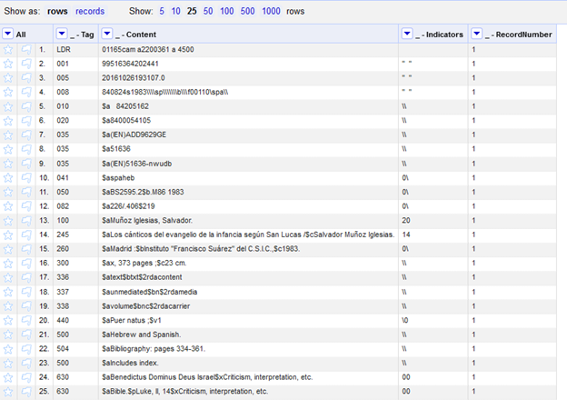
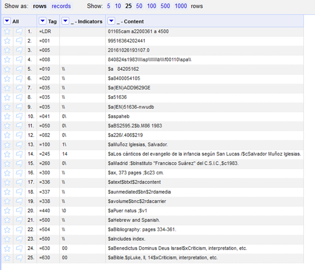

# Openrefine marcedit import
These are instructions for how I imported an OpenRefine project back into MarcEdit. I started with Terry Reese's instructions for exporting .mrk files into OpenRefine: https://blog.reeset.net/archives/1873. The import steps did not work on the latest version of OpenRefine, so this is how I worked around that issue. 

## Instructions

### In OpenRefine
<ol>
<li>Follow the instructions for exporting a file: https://blog.reeset.net/archives/1873.</li>
<li>	In OpenRefine, open the exported document. It should look like Image 1.</li>
<li>Remove the column “_ - Record Number”</li>
<li>If needed, move the column “_ - Indicators” so the document is in the right order: Tag, Indicators, Content.</li>
<li>Make all the edits you want in Refine.</li>
<li>Prepare the document to import back into MarcEdit:
<ul>
<li>Edit the Tag so there is an “=” in front of each like like it appears as .mrk in the MarcEditor.	There are multiple ways to go about this, I created a new column based on the _ -Tag using the GREL expression: `“=” + value` (see GREL expression 1)</li>
<li>Edit the _ - Indicators column to remove the quotation marks in the fixed fields (see GREL expression 1)</li>
<li>The project should be: Tags, Indicators, Content. (see Image 2).</li></ol>

### In MarcEdit
<ol>
<li>Open the .tsv file in the MarcEditor. Save a copy as .mrk. The formatting will be off, but the file should open with the correct encoding. The follow steps fix the formatting so the records will validate.</li>
<li>Delete any column headers from OpenRefine</li>
<li> The following regular expression replacements need to be done to make the file validate as .mrk. The file open-refine-import-tasks.task will also do these replacements. Make sure the tasks are run in the correct order. 
<ol>

Find: `^=LDR\t\t`
Replace: `=LDR  `

Find: `(^=00[123456789])(\t)(..)(\t)(.+)`
Replace: `$1  $5`

Find `(^=\d\d\d)(\t)(..)(\t)(.+)`
Replace: `$1  $3$5`

Find: `(")(.+?)("")`
Replace: `$2"`

Find: `("")(.+?)(")`
Replace: `"$2`

</ol>

<li>With these changes, the Field Count report should work.</li>
<li>Inspect the document for other changes that might be needed.</li>
<li>Disclaimer! This worked on my set of records but it might create validation issues on another set of records. For example, if there are quotation marks in the content column, the .tsv export in Refine creates a second set of quotation marks around the tag content. These are fixed using the tasks, but it does concern me that there might be other issues, so tread carefully! The MarcEdit validator tool helped to review my records for issues.</li></ol>

## Images

#### Image 1

#### Image 2

